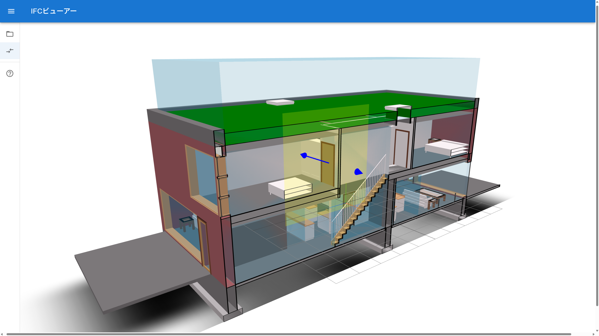

# IFC Viewer Using React Hooks With TypeScript

## 概要

- IFC Viewerです。
    - [https://github.com/ThatOpen/web-ifc-viewer]をベースに、日本語を含むIFCを扱えるようにしました。
    - **※web-ifc-viewerはDeprecatedのようなので、本リポジトリは習作として御覧ください。**

## 利用方法
- [s246wv.github.io/ifcjs-viewer-dev/](https://s246wv.github.io/ifcjs-viewer-dev/)からでもアプリにアクセスできます。
- 描画例

## License
This repository is licensed under MIT License (see [LICENSE file](LICENSE) for details)
このリポジトリのライセンスは MIT License です(詳細は[LICENSEファイル](LICENSE)を御覧ください)。